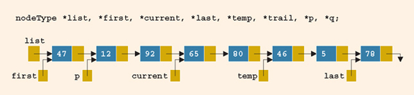

Use the following figure to answer the questions below.




# Problem 1

*(15 points)* What is the value of each of the following relational expressions (true or false)?

* `temp->link == 0`
* `last->link == nullptr`
* `list->link == p`

## Solution

### 1. `temp->link == 0`

This is saying that `temp->link` is `NULL`, which is **false**, since there is a node after `temp`. The correct statement would be `last->link == 0`.

### 2. `last->link == nullptr`

This is **true**, by the above (since `nullptr == NULL == 0`.)

### 3. `list->link == p`

This is **true**, since `list` is a pointer that points to the first node and `p` is a pointer that points to the second node.

---

\pagebreak
# Problem 2

*(10 points)* What are the effects, if any, of each of the following C++ statements?

* `temp->link = last;`
* `first->info = 58;`

## Solution

### 1. `temp->link = last;`

`temp` currently points to the node containing `46`, and `temp->link = last` sets the link from that node to point at the node containing `78`. This effectively removes the node containing `5` from the list (but does not clear the data from memory).

### 2. `first->info = 58;`

This changes the data stored in the first node from `47` to `58`. It leaves the first node's link and the rest of the list unchanged.

---

\pagebreak
# Problem 3

*(15 points)* Write a C++ statement to perform the following:

* Advance `first` to point to the next node.
* Make `trail` point to the node before `current`.
* Make `p` point to an empty list.

## Solution

### 1. Advance `first` to point to the next node. 

`first = first->link;`

### 2. Make `trail` point to the node before `current`.

The following code block will make `trail` point to the node just before `current` from first principles:

```cpp
nodeType tempNode = head;

// Traverse through the list until the NEXT node is `current`
while (tempNode->link != current)
{ 
    tempNode = tempNode->link;
}

trail = tempNode;
```

Alternatively, we could write `trail = p->link;`, since `p` is currently set to be two nodes before `current`.

### 3. Make `p` point to an empty list.

`p = NULL;`

---
