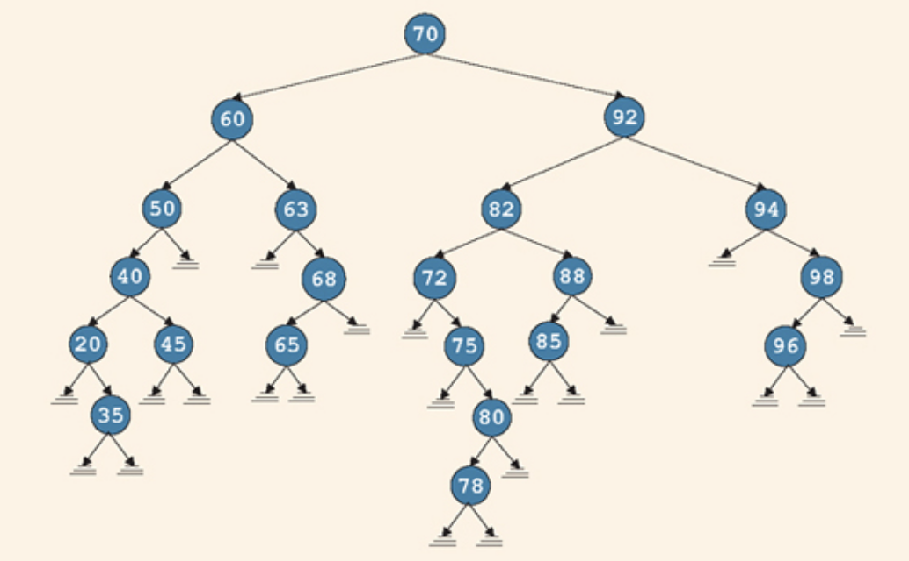
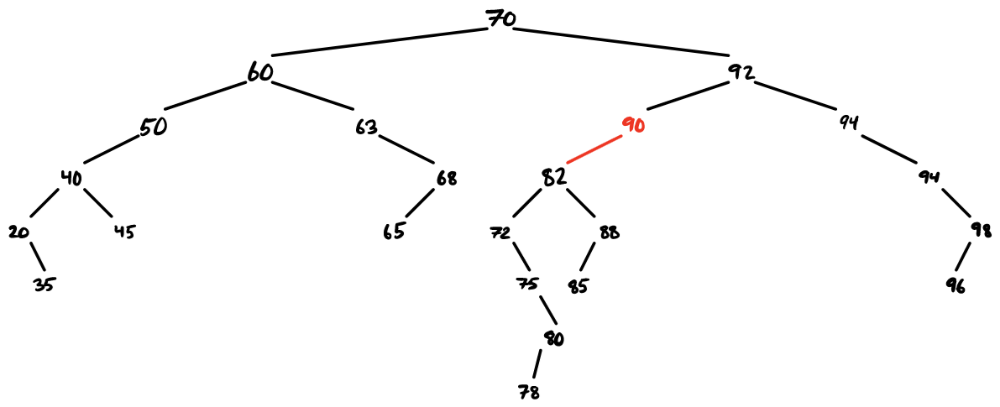
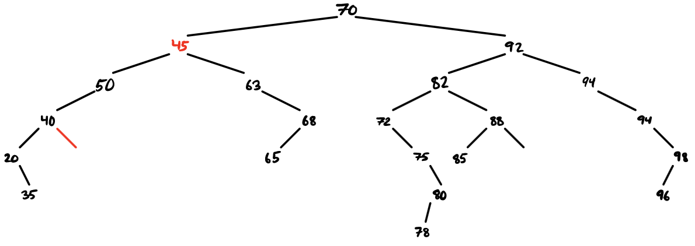
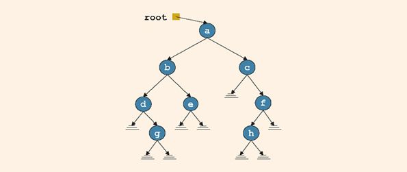

\newcommand{\red}[1]{\textcolor{red}{#1}}
\newcommand{\blu}[1]{\textcolor{blue}{#1}}

# Problem 1

Consider the following binary search tree



1. List the nodes of this tree in an inorder sequence, then in a preorder sequence, and finally in a postorder sequence.
2. What is the height of the tree with root 60? What is the level of the node with info = 75?
3. List the path from the node with info 92 to the node with info 78.
4. Insert a node with 90 and redraw the tree.
5. Delete the node with 60 and redraw the tree.

## Solution

### Problem 1 Part 1.

In an *inorder* traversal of a tree $T$, we first visit the left subtree $L(T)$, then we visit the root node $N(T)$, and then we visit the right subtree $R(T)$. For this tree, the sequence of nodes we visit will be:
$$
    20, 35, 40, 45, 50, 60, 63, 65, 68, 70, 72, 75, 78, 80, 82, 85, 88, 92, 94, 96, 98.
$$
Incidentally, this also lists the nodes in ascending order, since this is a binary search tree.

In a *preorder* traversal of a tree $T$, we first visit the root node $N(T)$, then the left subtree $L(T)$, and finally the right subtree $R(T)$. For this tree, the sequence of nodes we visit will be:
$$
    70, 60, 50, 40, 20, 35, 45, 63, 68, 65, 92, 82, 72, 75, 80, 78, 88, 85, 94, 98, 96.
$$

In a *postorder* traversal of a tree $T$, we first visit the left subtree $L(T)$, then the right subtree $R(T)$, and finally the root node $N(T)$. For this tree, the sequence of nodes we visit will be:
$$
    35, 20, 45, 40, 50, 65, 68, 63, 60, 78, 80, 75, 72, 85, 88, 82, 96, 98, 94, 92, 70.
$$

### Problem 1 Part 2.

Recall that the height of a binary tree is the length of the longest path within that tree to a leaf. Since the longest path from 60 to a leaf (35) is 4, \red{the height of the tree with root 60 is 4}.

Recall that the level of a node is the length of the path from the root node to the node in question. The unique path from the root to the node with info 75 is: $70 \to 92 \to 82 \to 72 \to 75$, so \red{the level of this node is 4}.

### Problem 1 Part 3.

The path from the node with info 92 to the node with info 78 is $92 \to 82 \to 72 \to 75 \to 80 \to 78$.

### Problem 1 Part 4.



### Problem 1 Part 5.

The node with info 60 has two subtrees, so using the algorithm discussed in class, we first swap the node with info 60 with the right-most node in the left subtree (which is the node with info 45). We then delete the node with info 60, which is equivalent to forcing its parent node (with info 40) to point to `nullptr`. The tree is shown below.



---

# Problem 2

Consider the following binary tree



1. Using the nonrecursive algorithm, perform an inorder traversal of the above tree (by hand) and draw the stack after each push and pop operation.  
2. Repeat the above for the nonrecursive preorder traversal drawing the stack after each push and pop operation. 

## Solution

### Problem 2 Part 1.

Pseudocode for the nonrecursive inroder traversal is shown:
```cpp
current = root;

while (current is not null or stack is nonempty)
{ 
    if (current is not null)
    { 
        push current onto stack;
        current = current->lLink;   // Move to the left child
    }
    else
    { 
        current = stack.top();
        pop stack;
        visit current;              // Visit the node
        current = current->rLink;   // Move to the right child
    }
}
```

In what follows, \red{red text} will denote data that has been **popped from the stack**. Then, the sequence of stacks will be:
\begin{align*}
    \text{stack} &= \{ a \} \\
    \text{stack} &= \{ a, b \} \\
    \text{stack} &= \{ a, b, d \} \\
    \text{stack} &= \{ a, b, \red{d} \} \\
    \text{stack} &= \{ a, b, \red{d}, g \} \\
    \text{stack} &= \{ a, b, \red{d}, \red{g} \} \\
    \text{stack} &= \{ a, \red{b}, \red{d}, \red{g} \} \\
    \text{stack} &= \{ a, \red{b}, \red{d}, \red{g}, e \} \\
    \text{stack} &= \{ a, \red{b}, \red{d}, \red{g}, \red{e} \} \\
    \text{stack} &= \{ a, \red{b}, \red{d}, \red{g}, \red{e}, c \} \\
    \text{stack} &= \{ a, \red{b}, \red{d}, \red{g}, \red{e}, \red{c} \} \\
    \text{stack} &= \{ a, \red{b}, \red{d}, \red{g}, \red{e}, \red{c}, f \} \\
    \text{stack} &= \{ a, \red{b}, \red{d}, \red{g}, \red{e}, \red{c}, f, h \} \\
    \text{stack} &= \{ a, \red{b}, \red{d}, \red{g}, \red{e}, \red{c}, f, \red{h} \} \\
    \text{stack} &= \{ a, \red{b}, \red{d}, \red{g}, \red{e}, \red{c}, \red{f}, \red{h} \} \\
    \text{stack} &= \{ \red{a}, \red{b}, \red{d}, \red{g}, \red{e}, \red{c}, \red{f}, \red{h} \}.
\end{align*}


### Problem 2 Part 2.

Pseudocode for the nonrecursive preroder traversal is shown:
```cpp
current = root;

while (current is not null or stack is nonempty)
{ 
    if (current is not null)
    { 
        push current onto stack;
        visit current;
        current = current->lLink;   // Move to the left child
    }
    else
    { 
        current = stack.top();
        pop stack;
        current = current->rLink;   // Move to the right child
    }
}
```

Again, in what follows, \red{red text} will denote data that has been **popped from the stack**. Then, the sequence of stacks will be:
\begin{align*}
    \text{stack} &= \{ a \} \\
    \text{stack} &= \{ a, b \} \\
    \text{stack} &= \{ a, b, d \} \\
    \text{stack} &= \{ a, b, \red{d} \} \\
    \text{stack} &= \{ a, b, \red{d}, g \} \\
    \text{stack} &= \{ a, b, \red{d}, \red{g} \} \\
    \text{stack} &= \{ \red{a}, \red{b}, \red{d}, \red{g} \} \\
    \text{stack} &= \{ \red{a}, \red{b}, \red{d}, \red{g}, e \} \\
    \text{stack} &= \{ \red{a}, \red{b}, \red{d}, \red{g}, \red{e} \} \\
    \text{stack} &= \{ \red{a}, \red{b}, \red{d}, \red{g}, \red{e}, c \} \\
    \text{stack} &= \{ \red{a}, \red{b}, \red{d}, \red{g}, \red{e}, \red{c} \} \\
    \text{stack} &= \{ \red{a}, \red{b}, \red{d}, \red{g}, \red{e}, \red{c}, f \} \\
    \text{stack} &= \{ \red{a}, \red{b}, \red{d}, \red{g}, \red{e}, \red{c}, f, h \} \\
    \text{stack} &= \{ \red{a}, \red{b}, \red{d}, \red{g}, \red{e}, \red{c}, f, \red{h} \} \\
    \text{stack} &= \{ \red{a}, \red{b}, \red{d}, \red{g}, \red{e}, \red{c}, \red{f}, \red{h} \}.
\end{align*}
Functionally, the only difference between the sequence of stacks in this traversal and that of the inorder traversal is that nodes are visited *before* they are popped off of the stack in a preorder traversal, whereas they are visted *as* they are popped in an inroder traversal.

---

# Problem 3

The `nodeCount()` function in binaryTreeType is to count the number of nodes in a binary tree starting from an input root node. 

1. Describe a recursive algorithm to for the `nodeCount` function.
2. Complete the `nodeCount` function in the binaryTreeType template class.
3. What is the time complexity (in big-O notation) for `nodeCount`?

## Solution

### Problem 3 Part 1.

A *node* is a `nodeType` object which is not null. If a node `p` is not null, then we can add it to the sum of the nodes. In general, the nodes of any tree $T$ can be categorized into the root node, the nodes in the left subtree $L(T)$, and the nodes in the right subtree $R(T)$. Hence the number of nodes $N(T)$ in tree $T$ is 
$$
    N(T) = 1 + N(L(T)) + N(R(T)).
$$
Hence the recursive implementation is as follows:
```cpp
template <class elemType> nodeCount(nodeType<elemType> *p)
{
    if (p == nullptr) { return 0; }
    return 1 + nodeCount(p->lLink) + nodeCount(p->rLink);
}
```

### Problem 3 Part 2.

See binaryTree.h

### Problem 3 Part 3.

This algorithm visits every node in the binary tree, so it is $\mathcal{O}(n)$ in time complexity.

---

# Problem 4

The `leavesCount()` function in binaryTreeType is to count the number of leaves in a binary tree starting from an input root node.

1. Describe a recursive algorithm to for this function.
2. Complete the `leaveCount()` function in the binaryTreeType template class.
3. What is the time complexity (in big-O notation) for `leavesCount`?

## Solution

### Problem 4 Part 1.

A *leaf* is a `nodeType` object for which at least one of `lLink` and `rLink` is not null. If `p` is not null *and* `p.lLink == p.rLink == nullptr`, then we add one to the sum of the leaves. Hence the recursive implementation is as follows:
```cpp
template <class elemType> leavesCount(nodeType<elemType> *p)
{
    if (p == nullptr) { return 0; }
    if (p->lLink == nullptr && p->rLink == nullptr) { return 1; }
    return leavesCount(p->lLink) + leavesCount(p->rLink);
}
``` 

### Problem 4 Part 2.

See binaryTree.h

### Problem 4 Part 3.

This algorithm loops through all of the nodes in the tree, just like `nodeCount()` did, and so the time complexity is $\mathcal{O}(n)$.

---
