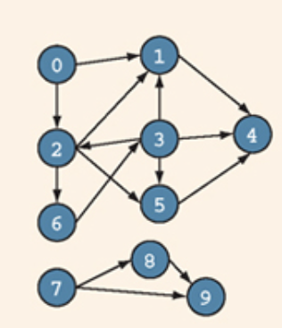
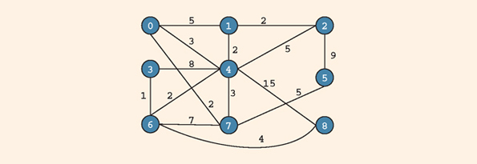

\newcommand{\red}[1]{\textcolor{red}{#1}}
\newcommand{\blu}[1]{\textcolor{blue}{#1}}

# Problem 1

Consider the following graph

1. Draw the adjacency matrix for this graph.
2. Draw the adjacency list for this graph.
3. List the nodes of the graph in a depth-first order.
4. List the nodes of the graph in a breadth-first order. 

## Solution

---

# Problem 2

Consider the following graph

Let the vertex with 0 be the source. Using Dijkstra's algorithm, find the minimum path from the source to every other vertex. List out the vertices in the order they are examined.

## Solution

---

# Problem 3

Consider the following graph

Draw *a* spanning tree for this graph.

## Solution

---

# Problem 4

Consider the following graph

Using Prim's algorithm, find the minimum spanning tree. List all the edges and weights added to the tree. What is the weight of the tree?

## Solution

---

# Problem 5

A cycle in $G$ is a simple path in which the first and last vertices are the same. Describe an algorithm for determining if a cycle exists in a graph $G$.

## Solution

---

# Problem 6

Dijkstra's algorithm only works on a graph in which all edges are positive numbers. Suppose you have a weighted graph where the smallest edge has weight $M$ where $M < 0$. If you add $M + 1$ to the weight of every edge, can you then run Dijkstra's algorithm to find the minimum path from a source vertex to all other vertices? Why or why not? If not, use an example to demonstrate. 

## Solution

---

# Problem 7

Using the code provided in the textbook (`Files -> Lecture Code -> Graphs`), write a short program that will read in a (unweighted) graph information from a text file and then print out the depth first traversal and breadth first traversal. Use your program to test your answer to Problem 1.

## Solution

See `main.cpp`.

---