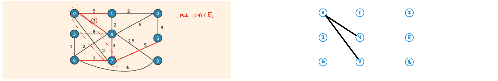

\newcommand{\red}[1]{\textcolor{red}{#1}}
\newcommand{\blu}[1]{\textcolor{blue}{#1}}
\newcommand{\p}{\phantom{1}}

# Problem 1

Consider the following graph


1. Draw the adjacency matrix for this graph.
2. Draw the adjacency list for this graph.
3. List the nodes of the graph in a depth-first order.
4. List the nodes of the graph in a breadth-first order. 

## Solution

### Problem 1 Part 1.

Note that this graph $G$ is a *directed*, so $(a, b) \in E(G)$ does not necessarily imply $(b, a) \in E(G)$. Recall that the adjacency matrix $A_G = (a_{ij})$ has component $a_{ij} = 1$ if and only if $(v_i, v_j) \in E(G)$, i.e., if and only if there is an edge connecting vertex $v_i$ to vertex $v_j$. That is,
$$
a_{ij} = 
\begin{cases}
1   & \text{if } (v_i, v_j) \in E(G) \\
0   & \text{else}
\end{cases}
$$
The components are zero otherwise. Hence, the adjacency matrix for this graph is:
$$
A = 
\begin{pmatrix}
0 &1  &1  &0  &0  &0  &0  &0  &0  &0  \\ 
0 &0  &0  &0  &1  &0  &0  &0  &0  &0  \\
0 &1  &0  &0  &0  &1  &1  &0  &0  &0  \\
0 &1  &1  &0  &1  &1  &0  &0  &0  &0  \\
0 &0  &0  &0  &0  &0  &0  &0  &0  &0  \\
0 &0  &0  &0  &1  &0  &0  &0  &0  &0  \\
0 &0  &0  &1  &0  &0  &0  &0  &0  &0  \\
0 &0  &0  &0  &0  &0  &0  &0  &1  &1  \\
0 &0  &0  &0  &0  &0  &0  &0  &0  &1  \\
0 &0  &0  &0  &0  &0  &0  &0  &0  &0  
\end{pmatrix}
$$

### Problem 1 Part 2.

An adjacency list is a set of linked lists, one for each vertex $v$, where each node of the linked list contains a vertex $u$ for which $(v, u) \in E(G)$. Our adjacency list is as follows:
\begin{align*}
0 \quad:&\quad [1, 2] \\
1 \quad:&\quad [4] \\
2 \quad:&\quad [1, 5, 6] \\
3 \quad:&\quad [1, 2, 4, 5] \\
4 \quad:&\quad [] \\
5 \quad:&\quad [4] \\
6 \quad:&\quad [3] \\
7 \quad:&\quad [8, 9] \\
8 \quad:&\quad [9] \\
9 \quad:&\quad [] 
\end{align*}

### Problem 1 Part 3.

Assume we start each search at the smallest non-visited vertex, and that at each vertex $v$ in the traversal we choose to visit the minimal $u \in V(E)$ not already visited such that $(v, u) \in E(G)$. Then the depth-first traversal on $G$ looks like:
$$
(0 \to 1 \to 4) \to (2 \to 5) \to (3) \to (6), (7 \to 8 \to 9).
$$
Here the parentheses represent a single iteration  of the search before backtracking. We visit 0, then 1, and then 4 before having to go back to node 0 to visit 2. Commas separate components of the graph.

### Problem 1 Part 4.

Assume we start each search at the smallest non-visited vertex, and that at each vertex $v$ in the traversal we first choose to visit the minimal $u \in V(E)$ not already visited such that $(v, u) \in E(G)$. Then the breadth-first traversal on $G$ looks like:
$$
0 \to  (1, 2) \to (4, 5) \to 6 \to 3 \to 7 \to (8, 9).
$$
Here each "$\to$" denotes moving to the next "level" of the algorithm, and vertices separated by commas denote all of the vertices that are visited at the same level.

---

\pagebreak
# Problem 2

Consider the following graph


Let the vertex with 0 be the source. Using Dijkstra's algorithm, find the minimum path from the source to every other vertex. List out the vertices in the order they are examined.

## Solution

Shown below is the pseudocode for Dijkstra's algorithm:
```cs
// Distance from source s = 0.
// Add all vertices V of E to queue. The value of each v in V is W(s, v).
priorityQueue q = {(v, W(s, v))} for v in V;
int [] smallestWeight[v] = W(s, v) for v in V;
bool [] weightFound = {true, **false};

while q is not empty
{
    remove vertex u from q;
    foreach vertex w in adjacent(u)
    {
        if (smallestWeight(w) > smallestWeight(u) + W(u, w))
        {
            smallestWeight(w) = smallestWeight(u) + W(u, w);
            weightFound(w) = true;
        }
    }
}
```

In what follows, let `sW` denote `smallestWeight` and `f` denote `weightFound`. Then choosing the source to be the vertex with info 0, we have the following:

| node | 0   | 1   | 2   | 3   | 4        | 5        |
| ---- | --- | --- | --- | --- | -------- | -------- |
| `sW` | 0   | 3   | 15  | 4   | $\infty$ | $\infty$ |
| `f`  | T   | F   | F   | F   | F        | F        |

The queue is $q = \{ (1, 3), (2, 15), (3, 4), (4, \infty), (5, \infty) \}$.\footnote{As in the pseudocode, the notation "$(v, W(0, v)) \in q$" is such that $v$ is the value the vertex holds and $W(0, v$ is its associated weight. For instance, $(1, 3)$ means the vertex in question is the one with info $1$, and the weight associated with the edge from $0$ to $1$ is $3$.} We then pop the minimum-weight vertex from $q$, which is $u = 1$. For each vertex $w$ for which $(1, w) \in E(G)$, we update their weights:
\begin{align*}
    w = 2 &\implies sW(1) + W(1, w) = 3 + 5\p = 8\p < 15 = sW(w)    \implies sW(2) := 8\p \\
    w = 4 &\implies sW(1) + W(1, w) = 3 + 8\p = 11  < \infty = sW(w)\implies sW(4) := 11  \\
    w = 5 &\implies sW(1) + W(1, w) = 3 + 12  = 15  < \infty = sW(w)\implies sW(5) := 15
\end{align*}
After these updates, we are guaranteed to have found the minimum paths from 0 to 2, 4, and 5. These results are summarized in the following table:

| node | 0   | 1   | 2   | 3   | 4   | 5   |
| ---- | --- | --- | --- | --- | --- | --- |
| `sW` | 0   | 3   | 8   | 4   | 11  | 15  |
| `f`  | T   | T   | T   | F   | T   | T   |

The queue is now $q = \{ (2, 8), (3, 4), (4, 11), (5, 15) \}$. We pop the new minimum-weight vertex from $q$, which is $u = 3$. There are no connections corresponding to this vertex, so we move on.

The queue is now $q = \{ (2, 8), (4, 11), (5, 15) \}$. We pop the new minimum-weight vertex from $q$, which is $u = 2$. The only new connection is to node $4$, and
$$
    w = 4 \implies sW(2) + W(2, w) = 8 + 2 = 10 < 11 = sW(w) \implies sW(4) := 10. 
$$
After this update, we have:

| node | 0   | 1   | 2   | 3   | 4   | 5   |
| ---- | --- | --- | --- | --- | --- | --- |
| `sW` | 0   | 3   | 8   | 4   | 10  | 15  |
| `f`  | T   | T   | T   | F   | T   | T   |

Now the queue is $q = \{ (4, 11), (5, 15) \}$. We pop the new minimum-weight vertex from $q$, which is $u = 4$. The only connection $4$ has is to $5$, and
$$
    w = 5 \implies sW(4) + W(4, 5) = 11 + 8 = 19 \not< 15 = sW(w), 
$$
and so we do *not* update. Finally, we pop the last element from the queue, which is $u = 5$, but that contains no helpful information regarding minimal distances from $0$, so it is ignored. Finally, we have the following minimal paths:

| node | 0   | 1   | 2   | 3   | 4   | 5   |
| ---- | --- | --- | --- | --- | --- | --- |
| `sW` | 0   | 3   | 8   | 4   | 10  | 15  |
| `f`  | T   | T   | T   | T   | T   | T   |

---

\vfill \pagebreak
# Problem 3

Consider the following graph


Draw *a* spanning tree for this graph.

## Solution

A spanning tree of a connected graph $G = (E, V)$ is a graph $T = (E_T, V_T)$ for which $V_T = V$ and $E_T \subseteq E$ and which contains no cycles. Shown below is one such spanning tree:


---

\pagebreak
# Problem 4

Consider the following graph


Using Prim's algorithm, find the minimum spanning tree. List all the edges and weights added to the tree. What is the weight of the tree?

## Solution

We choose the vertex labeled $0$ as our starting location. As done in lecture, we construct a "covered" set, which contains only $0$, and an "uncovered" set, which contains all the other vertices. We then examine the set of edges connecting the covered set to the uncovered set, which in this case is $\{(0, 1), (0, 4), (0, 7)\}$. The edge with the minimum weight is $2$, which corresponds to the edge $(0, 7)$, so we add that edge to the spanning tree and the vertex $7$ to our "covered" set:\footnote{There is a problem in the figure that I do not have time to fix! The black edge $(0, 4)$ should *not* be included on the right. All remaining figures are correct.}


In the above, the red dotted circle corresponds to the "covered" set and the remaining vertices belong to the "uncovered" set. The vertices in red are those that connect the covered set to the uncovered set, and the minimal edge is circled.

Now the covered set includes vertices $1$ and $4$, and the connecting edges are $\{(0, 1), (0, 4), (7, 5), (7, 6)\}$. The edge with the minimal weight is $(0, 4)$ with a weight of $3$. Hence we add $(0, 4)$ to the spanning tree and $4$ to the covered set:



Proceeding similarly, the minimal edge is $(0, 1)$, so we add it to the spanning tree and add $1$ to the covered set.


The minimal edge is $(4, 6)$, so we add it to the spanning tree and add $6$ to the covered set:


$(3, 6)$ is now minimal:


Now $(1, 2)$ is the minimal edge.


Next, add $(6, 8)$:


Finally, we include $(7, 5)$.


This completes the spanning tree. Shown below is the completed tree, together with the associated weights.

\begin{center} 
    \includegraphics[width=8cm]{diagrams/hw_12_4.png}
\end{center}

The weight of the spanning tree is just the sum of the weights of the included edges, which is $21$.

---

\pagebreak
# Problem 5

A cycle in $G$ is a simple path in which the first and last vertices are the same. Describe an algorithm for determining if a cycle exists in a graph $G$.

## Solution

One such algorithm is a small variation of a depth-first search of a graph $G$. We run a depth-frist traversal of the graph, but instead of printing out the vertices upon visiting them, we check to see if we have visted this vertex before. If we *have* visited this vertex before, then we are in a cycle. If we traverse the entire graph without such a repetition, then there are no cycles. The pseudocode is as follows.

<span class="underline">**Depth-First Cycle Traversal for $G = (V, E)$.**</span>

Let $\mathscr{V} = \varnothing$ be the set of "visited" vertices.

Start at any $v \in V$ and add $v \in \mathscr{V}$.

For each vertex $u \in V$ such that $(v, u) \in E$:

$\quad$ if $u \in \mathscr{V}$, return `true`.

$\quad$ add $u \in \mathscr{V}$.

$\quad$ if $\mathscr{V} = V$, return `false`.

$\quad$ else, add $u \in \mathscr{V}$ and perform a depth-first cycle traversal at $u$.


---

\pagebreak
# Problem 6

Dijkstra's algorithm only works on a graph in which all edges are positive numbers. Suppose you have a weighted graph where the smallest edge has weight $M$ where $M < 0$. If you add $|M| + 1$ to the weight of every edge, can you then run Dijkstra's algorithm to find the minimum path from a source vertex to all other vertices? Why or why not? If not, use an example to demonstrate. 

## Solution

I claim that one *cannot* use Dijkstra's algorithm in this manner. In fact, minimality is not even preserved under this kind of transformation. As a counter-example, consider the following weighted graph.

\begin{center} 
    \includegraphics[width=8cm]{diagrams/hw_12_6_1.png}
\end{center}

The path from $0$ to $2$ given by $0 \to 1 \to 2$ has weight $1 + (-1) = 0$, while the path $0 \to 2$ has weight $1$l hence the minimal path is $0 \to 1 \to 2$.

Now suppose we add $|-1| + 1 = 2$ to each edge. We get the following weighted graph.\footnote{Another typo in the graph! Sorry for the poor quality work. The weights of edges $(0, 1)$ and $(0, 2)$ should be switched. This does not affect the argument that minimality is not preserved.}

\begin{center} 
    \includegraphics[width=8cm]{diagrams/hw_12_6_2.png}
\end{center}

Now the minimal path is $0 \to 2$ instead of $0 \to 1 \to 2$. Since minimality is not preserved, we cannot use Dijkstra's algorithm to find a minimal path along a negatively weighted graph.

---

\vfill \pagebreak
# Problem 7

Using the code provided in the textbook (`Files -> Lecture Code -> Graphs`), write a short program that will read in a (unweighted) graph information from a text file and then print out the depth first traversal and breadth first traversal. Use your program to test your answer to Problem 1.

## Solution

See `main.cpp`.

---